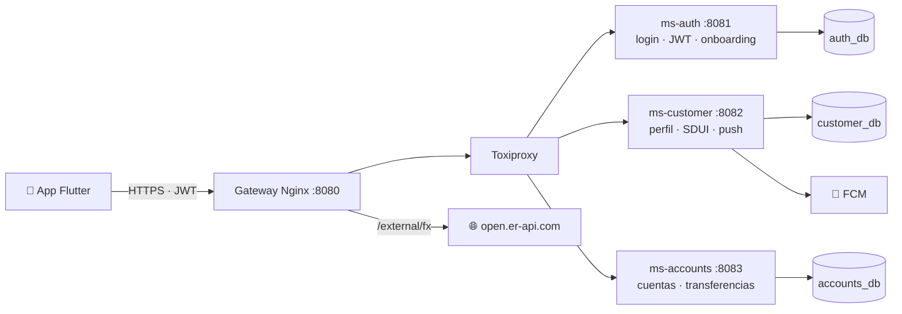

# Nexo Bank · Backend

[](https://github.com/victoriacusme/app-backend/actions/workflows/backend.yml)

Backend de **Nexo Bank** (banca personas) para la app móvil en Flutter. Son tres microservicios Spring Boot con
arquitectura hexagonal y una base de datos por servicio, detrás de un gateway Nginx.



Más diagramas (capas, modelo de datos, flujos de login, transferencia, onboarding, SDUI y resiliencia) en
[`docs/architecture.md`](docs/architecture.md).

| Servicio | Puerto | Responsabilidad |
|---|---|---|
| `gateway` | 8080 | Única entrada para la app |
| `ms-auth` | 8081 | Login (JSON o JWE), JWT RS256, refresh rotativo, logout, JWKS, onboarding |
| `ms-customer` | 8082 | Perfil, preferencias, experiencia dinámica (SDUI) y notificaciones push |
| `ms-accounts` | 8083 | Cuentas, movimientos y transferencias entre cuentas propias |
| `toxiproxy` | 8474 | API de control para los scripts de caos |
| `auth-db` · `customer-db` · `accounts-db` | 5433 · 5434 · 5435 | Una BD PostgreSQL por servicio |

## Cómo levantarlo

**Requisitos:** Docker con Compose v2. Para ejecutar los tests fuera de Docker: Java 21 y Maven 3.9.

```bash
docker compose up --build -d     # la primera vez tarda unos minutos (compila los tres servicios)
docker compose ps                # los servicios quedan "healthy" en ~30 s
curl localhost:8080/health       # {"status":"UP"}
```

Las bases de datos se crean con Flyway al arrancar e incluyen **datos de prueba**: clientes, cuentas con saldos
coherentes, movimientos y experiencias por segmento.

```bash
docker compose logs -f ms-accounts   # logs de un servicio
docker compose down                  # apagar (los datos se conservan)
docker compose down -v               # apagar y borrar las bases de datos
```

> **Configuración opcional:** copia `.env.example` a `.env` para fijar tus propias claves. Sin `.env` se usan
> valores de desarrollo. Las claves JWT, si no se fijan, se regeneran en cada reinicio de ms-auth y las sesiones
> abiertas dejan de servir.

## Usuarios de prueba

Contraseña de los tres: **`Nexo2026*`**

| Usuario | Segmento | Qué ve en el home |
|---|---|---|
| `ana` | Joven | Recargas, meta de ahorro (viaje), promoción de metas |
| `carlos` | Premium | Inversiones, asesor, **tipo de cambio** |
| `lucia` | Emprendedor | Cobro con QR, pago a proveedores, crédito para el negocio |

También se pueden crear usuarios nuevos con `POST /auth/register` (onboarding completo: credenciales, cliente y
cuenta de ahorros).

## API (vía gateway, `http://localhost:8080`)

| Método | Ruta | Descripción |
|---|---|---|
| POST | `/auth/login` | Login. JSON o JWE (`Content-Type: application/jose`) |
| POST | `/auth/refresh` · `/auth/logout` | Rotación y revocación del refresh token |
| POST | `/auth/register` | Onboarding: crea credenciales, cliente y cuenta (con compensación si algo falla) |
| GET | `/.well-known/jwks.json` | Claves públicas: firma de JWT (`sig`) y cifrado del login (`enc`) |
| GET | `/accounts` · `/accounts/{id}` | Cuentas del cliente (número enmascarado, montos como texto) |
| GET | `/accounts/{id}/movements?size=20&cursor=` | Movimientos paginados por cursor |
| POST | `/transfers/own` | Transferencia entre cuentas propias. Header **`Idempotency-Key`** obligatorio |
| GET | `/transfers/{id}` | Estado de una transferencia |
| GET | `/customers/me` | Perfil (cédula y teléfono enmascarados) y preferencias |
| PATCH | `/customers/me/preferences` | Idioma, tema, notificaciones y promociones (parcial) |
| PUT · DELETE | `/customers/me/devices` · `/customers/me/devices/{token}` | Registro del token de push del teléfono |
| GET | `/experience/home` | Home server-driven por segmento, hora y preferencias (con ETag) |
| GET | `/external/fx/latest/{moneda}` | Tipo de cambio (servicio externo `open.er-api.com`) |

**Convenciones:**
- Todas las rutas salvo login, refresh, register, JWKS y tipo de cambio requieren `Authorization: Bearer <accessToken>`.
- El cliente siempre se toma del token, nunca de un parámetro.
- Los montos viajan como texto (`"125.50"`) y las fechas en ISO-8601 UTC.
- Los errores son `ProblemDetail` con un `code` estable (`insufficient-funds`, `account-not-owned`...) y un
  `correlationId`.
- Toda respuesta lleva `X-Correlation-Id`. Si la app lo envía, se respeta y viaja por todos los servicios.

### Ejemplo rápido

```bash
TOKEN=$(curl -s -X POST localhost:8080/auth/login -H 'Content-Type: application/json' \
  -d '{"username":"ana","password":"Nexo2026*"}' | python3 -c 'import sys,json; print(json.load(sys.stdin)["accessToken"])')

curl -s localhost:8080/accounts -H "Authorization: Bearer $TOKEN"
curl -s localhost:8080/experience/home -H "Authorization: Bearer $TOKEN"

curl -s -X POST localhost:8080/transfers/own -H "Authorization: Bearer $TOKEN" \
  -H "Idempotency-Key: $(uuidgen)" -H 'Content-Type: application/json' \
  -d '{"sourceAccountId":"c0000000-0000-0000-0000-000000000011",
       "targetAccountId":"c0000000-0000-0000-0000-000000000012","amount":"25.00","description":"Ahorro"}'
```

## Demos

### Resiliencia: latencia y caídas (Toxiproxy)

Toxiproxy se ubica entre el gateway y cada servicio, así que permite degradar uno solo:

```bash
chaos/latency.sh accounts 3000   # +3 s en ms-accounts (la app muestra skeleton o datos en caché)
chaos/latency.sh accounts 12000  # supera el timeout del gateway (10 s): 503 service-unavailable
chaos/down.sh accounts           # ms-accounts caído: 503 inmediato; login y perfil siguen funcionando
chaos/status.sh                  # estado de cada servicio
chaos/reset.sh                   # todo vuelve a la normalidad
```

### Experiencia dinámica (SDUI): cambiar la app sin publicarla

```bash
scripts/experience.sh list                        # componentes del home y su estado
scripts/experience.sh on campaign-black-friday    # aparece un banner para todos los clientes
scripts/experience.sh off campaign-black-friday
```

### Notificaciones push

La app registra su token con `PUT /customers/me/devices`. Al completarse una transferencia, ms-accounts avisa a
ms-customer, que arma el texto en el idioma del cliente y lo envía a sus dispositivos.

- **Sin credenciales de Firebase** (por defecto), la notificación se registra en el log:
  `docker compose logs -f ms-customer | grep "Push simulado"`.
- **Para enviar por FCM**: guarda la cuenta de servicio de Firebase (JSON) en `secrets/firebase-adminsdk.json`
  (carpeta ignorada por git, montada en el contenedor), agrega a `.env`
  `FCM_CREDENTIALS_FILE=/run/secrets/nexo/firebase-adminsdk.json` y ejecuta `docker compose up -d ms-customer`.
  Al arrancar, el log dice `Notificaciones push vía Firebase Cloud Messaging`. La app necesita además su
  `google-services.json` (ver el README de la app).

## Tests

```bash
mvn test      # unitarios (Mockito) y de controladores; no necesita Docker
mvn verify    # además, integración con PostgreSQL real (Testcontainers); necesita Docker
```

El CI (GitHub Actions, `.github/workflows/backend.yml`) ejecuta `mvn verify` en cada push y en cada PR, y valida el
`docker-compose.yml`, la configuración del gateway y los scripts.

Los tests de integración cubren, entre otros casos:
- Concurrencia de transferencias: no se gasta más del saldo, no hay deadlocks y un doble toque genera una sola
  transferencia.
- Coherencia de la semilla.
- Paginación sin duplicados.
- Cifrado en reposo.
- Experiencias por segmento.

## Configuración

Variables principales (ver `.env.example`):

| Variable | Uso | Por defecto (desarrollo) |
|---|---|---|
| `JWT_SIGNING_KEY` / `JWT_ENCRYPTION_KEY` | Claves RSA (PEM PKCS#8) de ms-auth | Efímeras: se generan al arrancar |
| `INTERNAL_API_KEY` | API key de los endpoints `/internal/**` entre servicios | `dev-internal-key-change-me` |
| `CUSTOMER_DATA_KEY` | Clave AES-256 para cifrar cédula y teléfono | Clave fija de desarrollo en el compose |
| `FCM_CREDENTIALS_FILE` | Credenciales de Firebase para push real | Vacío: push simulado en el log |
| `DB_USER` / `DB_PASSWORD` | Credenciales de las BD | `nexo` / `nexo` |

## Estructura

```
├── ms-auth/ · ms-customer/ · ms-accounts/   microservicios (Spring Boot 3.5, Java 21)
│   └── src/main/java/ec/nexo/<servicio>/
│       ├── domain/           modelo y reglas de negocio (sin dependencias de frameworks)
│       ├── application/      casos de uso y puertos de salida
│       └── infrastructure/   adaptadores: web, JPA, HTTP, push, configuración
├── gateway/nginx.conf       gateway
├── chaos/                   Toxiproxy y scripts de caos
├── scripts/                 utilidades de demo (experiencia dinámica)
├── docs/                    documentación técnica
└── docker-compose.yml
```

## Documentación

- [`docs/architecture.md`](docs/architecture.md): diagramas de componentes, capas, modelo de datos y flujos críticos.
- [`docs/decisions.md`](docs/decisions.md): decisiones de arquitectura (ADR) con alternativas y trade-offs.
- [`docs/risks-and-scaling.md`](docs/risks-and-scaling.md): riesgos, cómo escalar y despliegue en producción.
- [`docs/security.md`](docs/security.md): autenticación, JWE, cifrado en reposo, servicio a servicio (mTLS), logs
  sin datos personales y gestión de secretos.
- [`docs/monitoring.md`](docs/monitoring.md): monitoreo en producción, SLO, alertas y cómo detectar problemas
  operativos y de experiencia de usuario.
- [`docs/ai-usage.md`](docs/ai-usage.md): cómo se usó la IA en el desarrollo y cómo se verificó lo que produjo.
