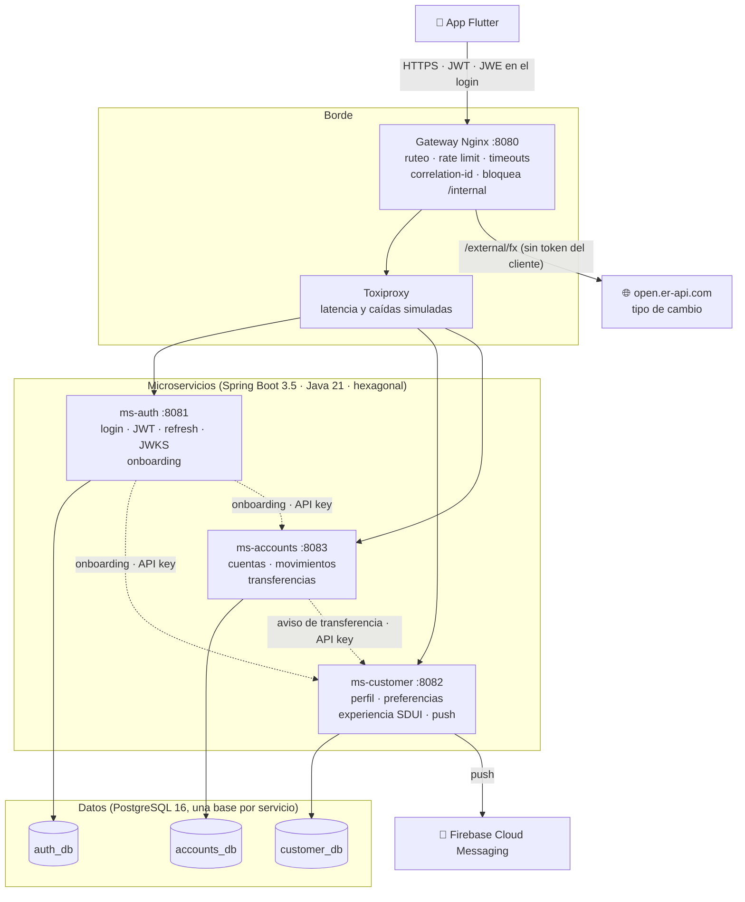
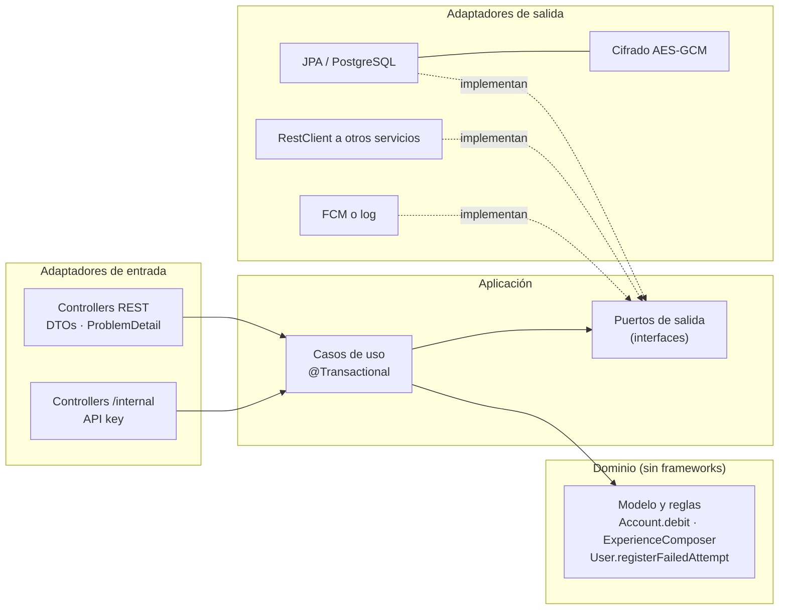
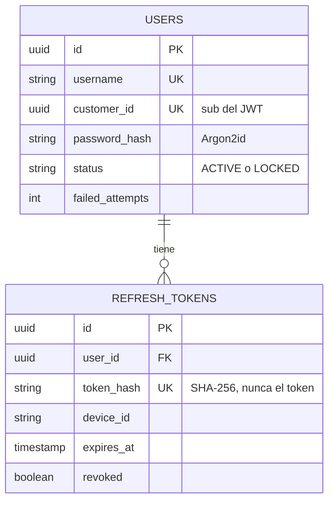
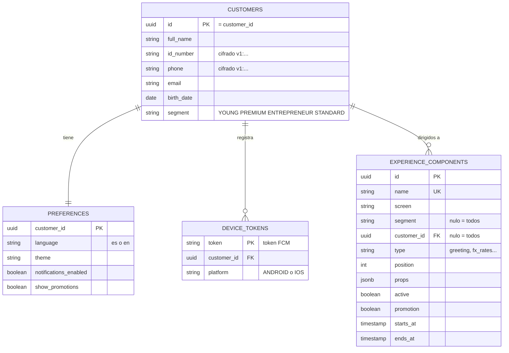
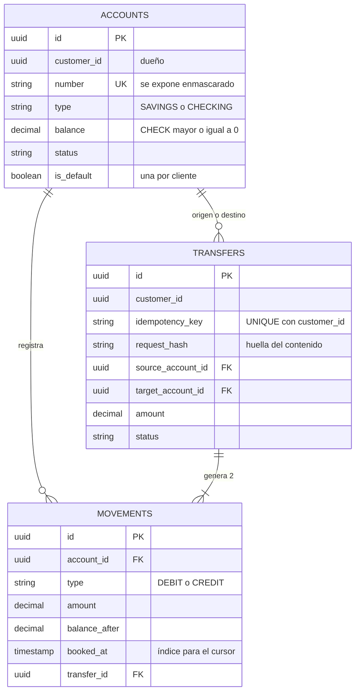
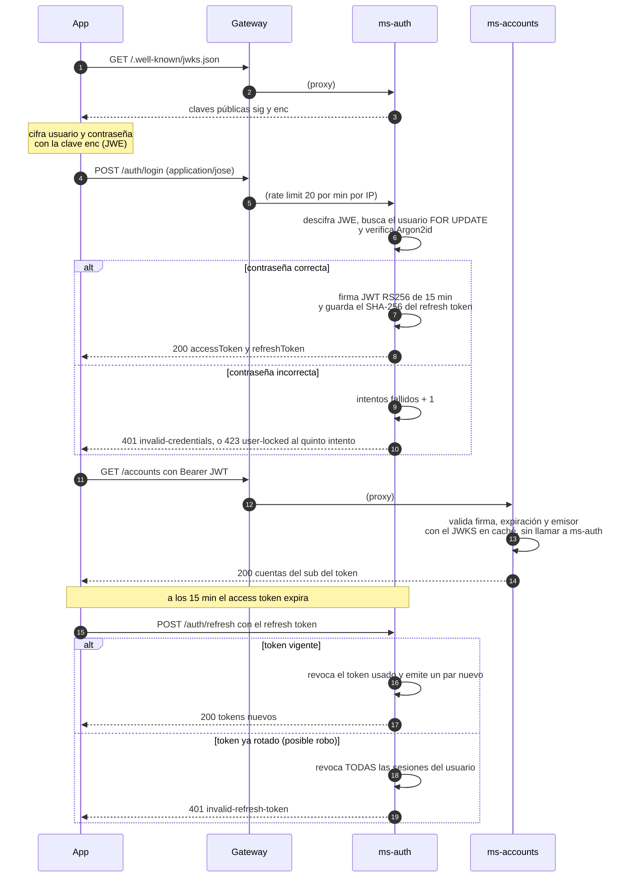
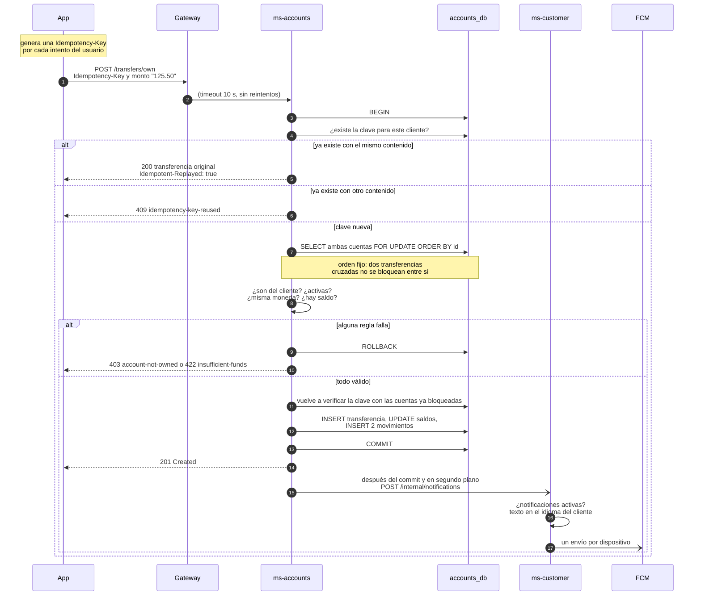
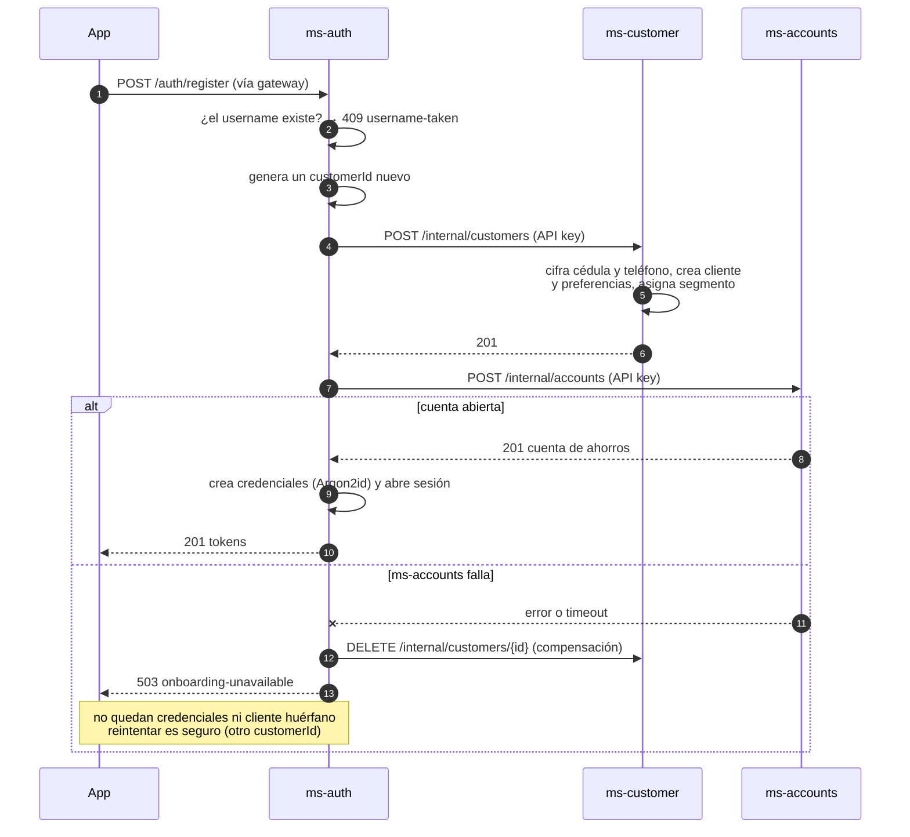
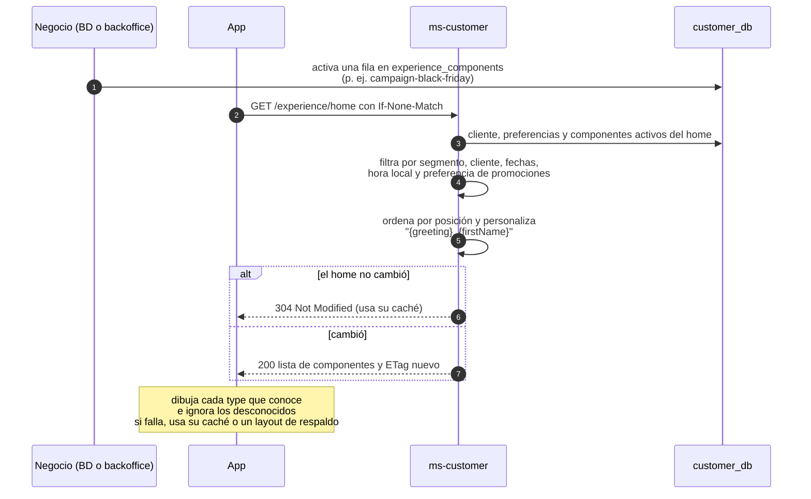
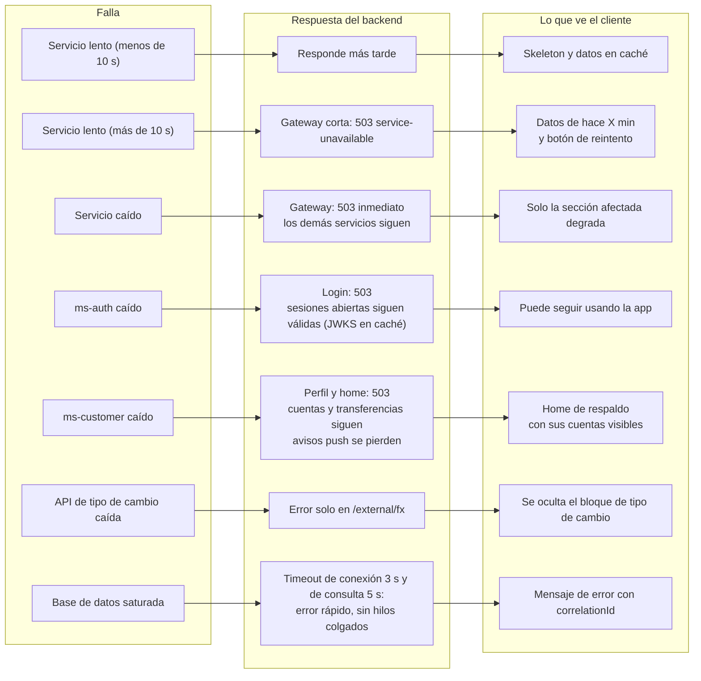

# Cómo está armado el backend

Este documento muestra, con diagramas, cómo están conectadas las piezas y cómo funcionan los flujos más
importantes: iniciar sesión, transferir, registrarse y armar el home. Los diagramas se leen de arriba hacia abajo.

> Las razones detrás de cada decisión están en [`decisions.md`](decisions.md).

## 1. Las piezas y cómo se conectan

**Cómo leerlo:**
- **La app habla con una sola puerta (el gateway).** El gateway reparte cada petición al servicio que
  corresponde.
- **Toxiproxy** está en el medio solo para simular fallas en las demos. En producción no existe.
- **Tres servicios, cada uno con su propia base de datos.** Ninguno lee la base de datos de otro.
- **Las líneas punteadas** son conversaciones internas entre servicios, protegidas con una clave. La app no puede
  llamarlas.
- **Para verificar la sesión**, `ms-customer` y `ms-accounts` no le preguntan a `ms-auth` en cada petición: usan la
  clave pública que guardaron en memoria.

## 2. Cómo está organizado cada servicio por dentro

**La idea:** las reglas del banco (el dominio) están en el centro y no dependen de nada técnico. Alrededor están
las piezas que se pueden cambiar: la base de datos, las llamadas a otros servicios, las notificaciones. Gracias a
eso, las reglas se prueban en milisegundos y sin base de datos.

## 3. Qué se guarda en cada base de datos

Cada servicio tiene su base. El identificador del cliente (`customer_id`) se repite entre ellas para relacionarlas,
pero ninguna se conecta directamente con otra.

**Usuarios y sesiones** (`ms-auth`): la contraseña nunca se guarda, solo una huella irreversible (Argon2).

**Clientes, preferencias y home** (`ms-customer`): la cédula y el teléfono se guardan cifrados.

**Cuentas y dinero** (`ms-accounts`): cada transferencia genera dos movimientos, uno de salida y uno de entrada.

## 4. Los flujos más importantes

### 4.1 Iniciar sesión y mantener la sesión abierta

**En resumen:** la app cifra la contraseña antes de enviarla. Si es correcta, recibe un pase de 15 minutos y un
pase de renovación. Si alguien intenta usar un pase de renovación que ya se usó, se cierran todas las sesiones de
ese usuario, por si fue robado.

### 4.2 Transferir entre cuentas propias

**En resumen:** cada intento lleva un "número de recibo" único. El backend reserva las dos cuentas, valida todo y
mueve el dinero en un solo paso. Si el mismo recibo llega dos veces, devuelve la transferencia original **sin mover
el dinero de nuevo**. El aviso al celular sale después, sin hacer esperar al cliente.

**Si la app no recibe respuesta** (por ejemplo, se cae la señal), **no reintenta sola**: le muestra al cliente "No
pudimos confirmar el resultado" y un botón **"Verificar estado"**, que reenvía el mismo recibo. Si la transferencia
ya se había hecho, el cliente ve la original; el dinero nunca se mueve dos veces.

### 4.3 Registrarse (con marcha atrás si algo falla)

**En resumen:** el registro crea el cliente y su cuenta, y **al final** el usuario. Si la cuenta no se puede abrir,
se borra el cliente que alcanzó a crearse y se pide reintentar. Así nunca queda alguien que pueda iniciar sesión sin
tener cuenta.

### 4.4 Armar el home de cada cliente

**En resumen:** el home es una lista de bloques guardada en la base de datos. El backend elige los que le
corresponden a cada cliente (según su segmento, la hora y sus preferencias) y la app los dibuja. Si el negocio
activa una campaña en la base de datos, aparece sin publicar una versión nueva de la app.

## 5. Qué pasa cuando algo falla

Cada falla afecta solo a su parte; el resto de la app sigue funcionando.

Todos estos casos se pueden mostrar en vivo con los scripts de `chaos/` (ver el README).
