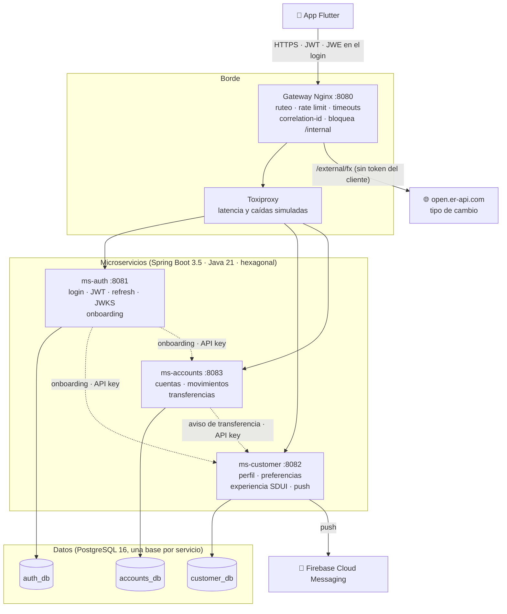
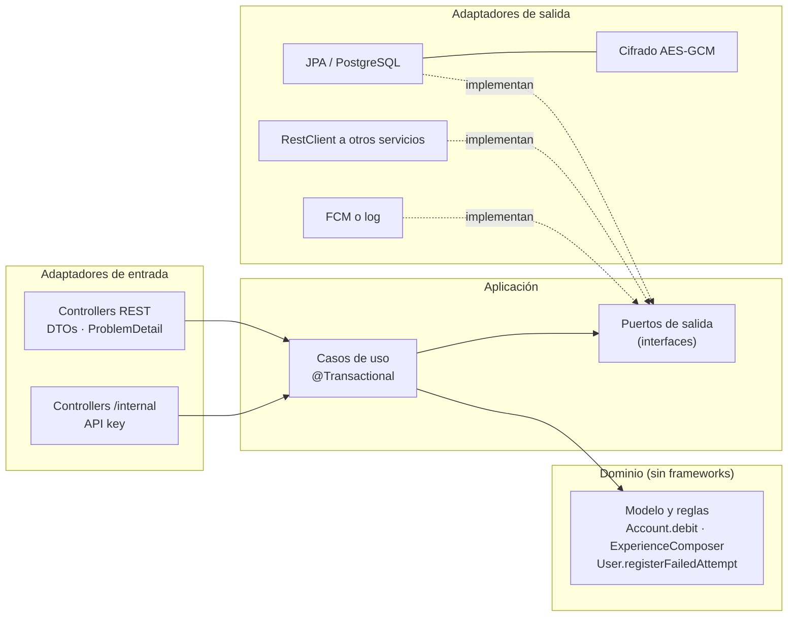
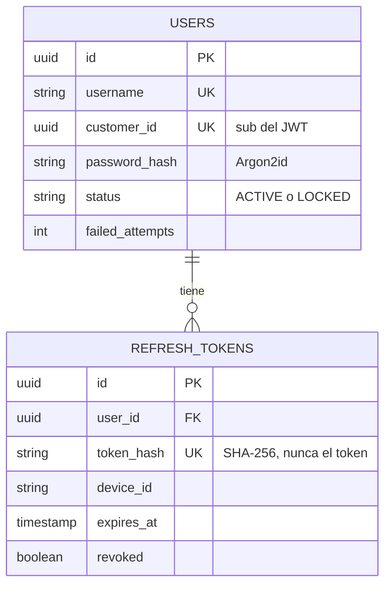
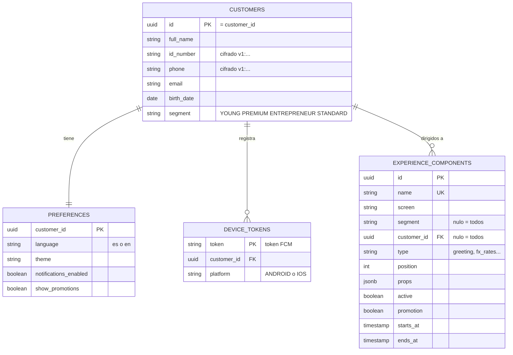
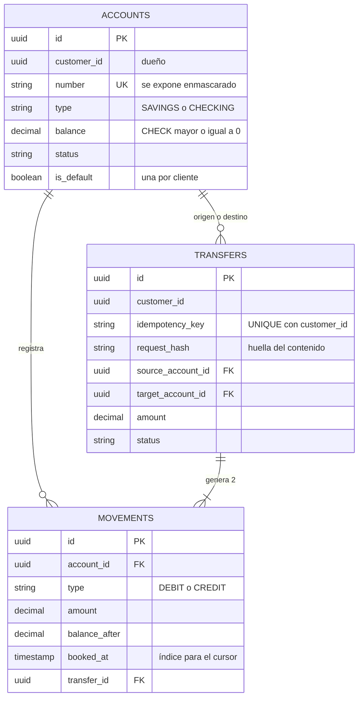
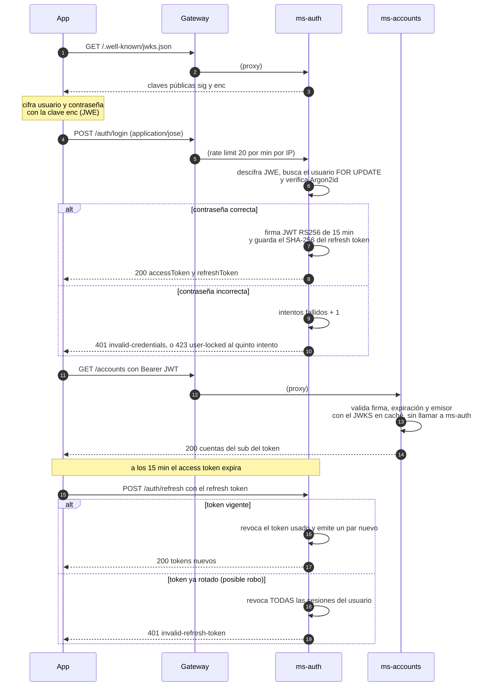
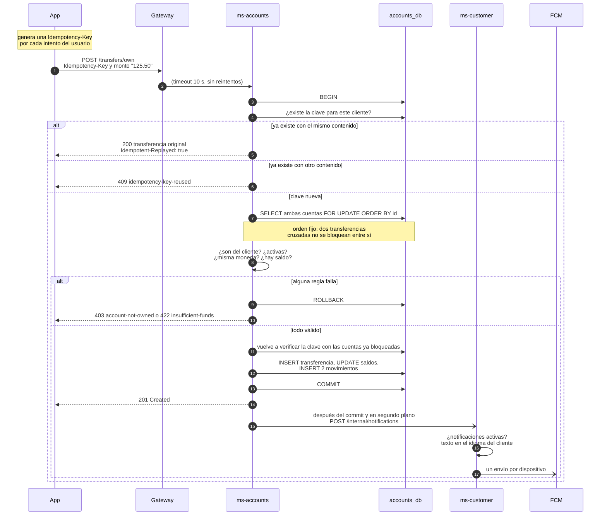
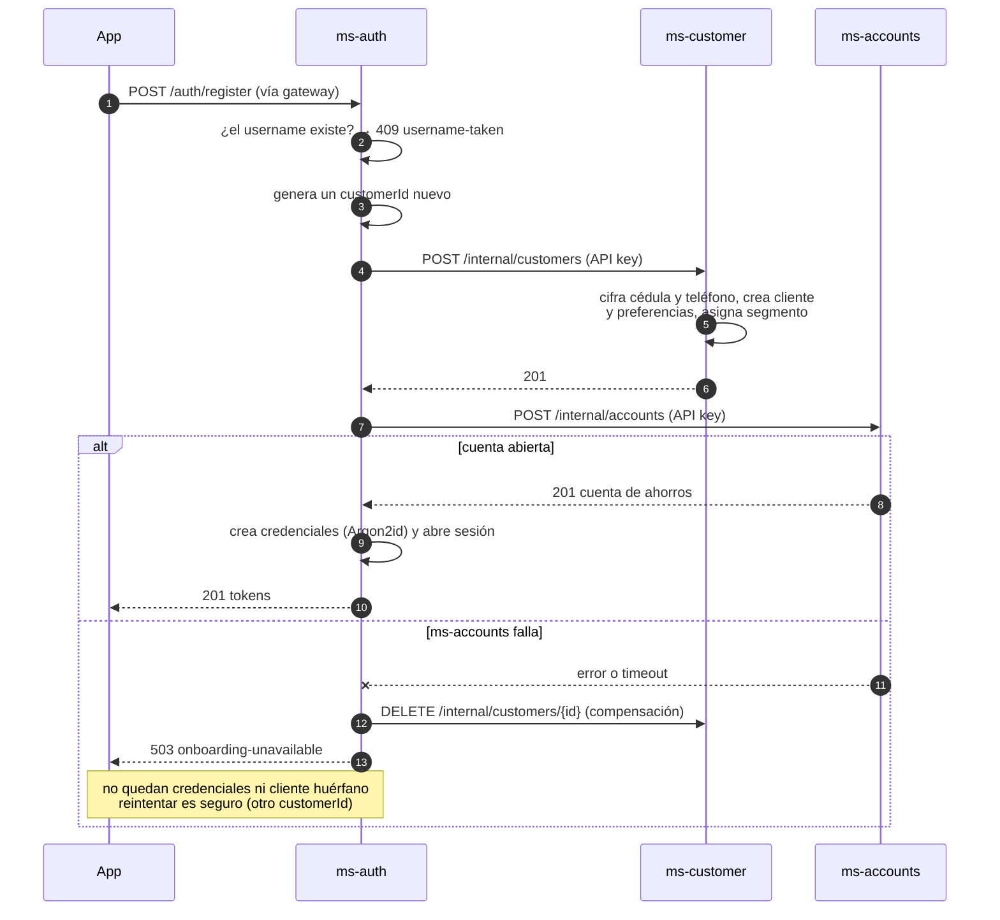
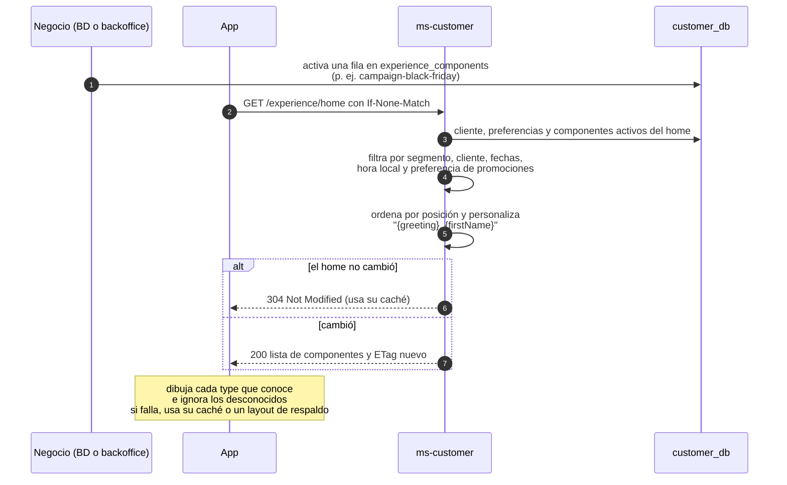
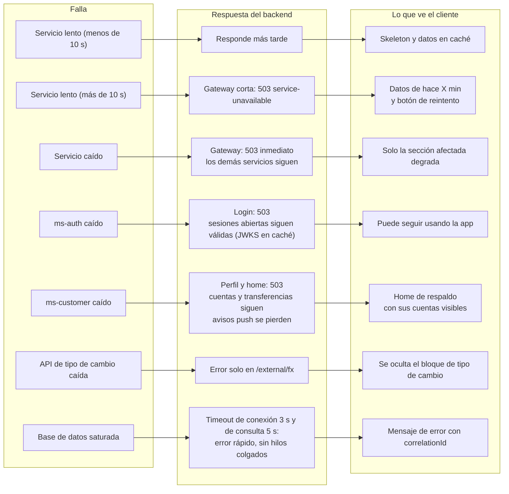

# Arquitectura

Vista general del backend de Nexo Bank y de sus flujos críticos. Las razones de cada decisión están en
[`decisions.md`](decisions.md); los riesgos y el despliegue en producción, en
[`risks-and-scaling.md`](risks-and-scaling.md).

## 1. Componentes

- **Línea continua:** tráfico de la app.
- **Línea punteada:** llamadas entre servicios por la red interna. Las rutas `/internal/**` exigen API key y el
  gateway no las expone.
- **Validación de tokens:** ms-customer y ms-accounts validan el JWT localmente con las claves públicas de ms-auth
  (JWKS), que guardan en caché. No llaman a ms-auth en cada petición.
- **Datos compartidos:** ningún servicio lee la base de datos de otro. Se relacionan solo por el `customerId`, que
  viaja como `sub` en el JWT.

## 2. Capas dentro de cada servicio (hexagonal)

Las dependencias apuntan hacia el dominio: el dominio no conoce Spring, JPA ni HTTP. Por eso los casos de uso se
prueban con Mockito, y los adaptadores aparte, contra PostgreSQL real.

## 3. Modelo de datos

Cada base pertenece a un solo servicio. El `customer_id` se repite entre bases como **referencia lógica**, sin llave
foránea entre servicios.

<em>auth_db (ms-auth)</em>

<em>customer_db (ms-customer)</em>

<em>accounts_db (ms-accounts)</em>

## 4. Flujos críticos

### 4.1 Login y renovación de sesión

### 4.2 Transferencia entre cuentas propias

**Si la app no recibe la respuesta** (timeout o corte de red), reenvía la **misma** solicitud con la **misma** clave.
Nunca se mueve dinero dos veces, y recibe el resultado original.

### 4.3 Onboarding con compensación

Las credenciales se crean **al final**: si algo falla antes, nunca queda un usuario que pueda iniciar sesión sin
cliente ni cuenta.

### 4.4 Experiencia dinámica (SDUI)

## 5. Resiliencia: qué pasa cuando algo falla

Todos estos escenarios se pueden reproducir en vivo con los scripts de `chaos/` (ver el README).
