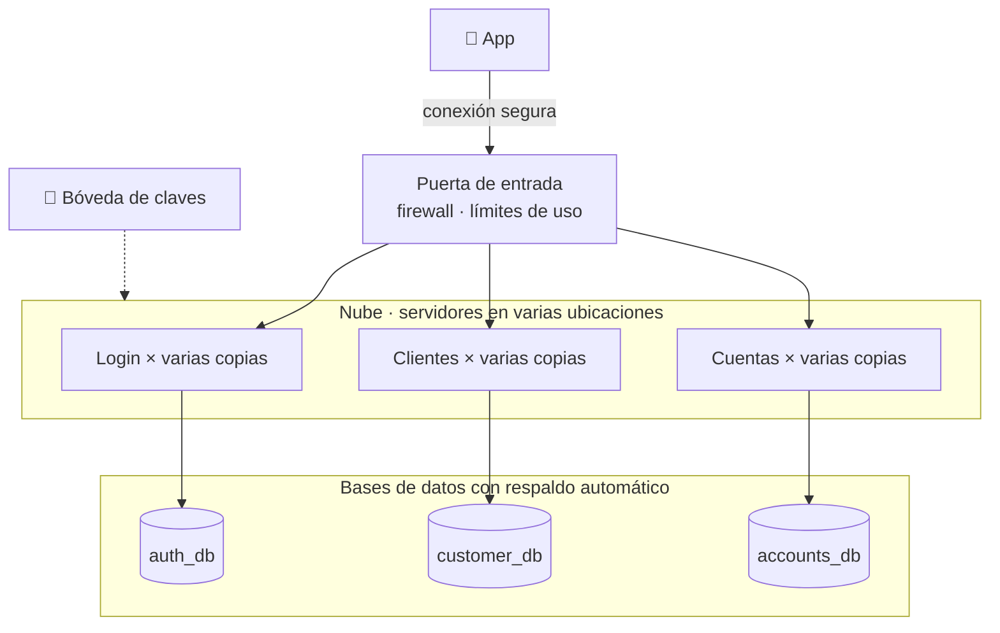

# Riesgos, crecimiento y puesta en producción

En pocas palabras: **qué podría salir mal, qué hice para evitarlo, cómo crecería el sistema si llegan muchos más
clientes y cómo lo pondría en producción.**

> Más detalle: seguridad en [`security.md`](security.md) y monitoreo en [`monitoring.md`](monitoring.md).

---

## 1. Riesgos: qué podría salir mal

Ordenados de más grave a menos grave. 🔴 grave · 🟡 molesto · 🟢 menor.

### 🔴 Que el dinero se mueva dos veces

**Cómo pasaría:** el cliente toca "Transferir" y la señal se cae justo en ese momento: la app no sabe si se hizo.
Si el cliente vuelve a intentarlo, podría transferir dos veces. O toca el botón dos veces seguidas.

**Qué hice:**
- Cada intento de transferencia lleva un "número de recibo" único (`Idempotency-Key`). Si llega dos veces el mismo
  recibo, el backend **no vuelve a mover el dinero**: devuelve la transferencia original.
- La app **nunca reintenta sola** una operación de dinero. Si no recibió respuesta, muestra "No pudimos confirmar el
  resultado" y un botón **"Verificar estado"**, que reenvía el mismo recibo.
✅ Probado enviando el mismo recibo 10 veces al mismo tiempo: se creó **una sola** transferencia.

### 🔴 Que un saldo quede mal

**Cómo pasaría:** dos transferencias sobre la misma cuenta al mismo tiempo. Las dos leen "saldo $100" y las dos
gastan $100.

**Qué hice:** mientras una transferencia trabaja con una cuenta, **la cuenta queda reservada** y la otra espera
su turno. Además, la base de datos rechaza cualquier saldo negativo.
✅ Probado lanzando a la vez 30 transferencias de $10 desde una cuenta con $100: pasaron exactamente 10 y el
saldo quedó en $0, nunca en negativo.

### 🔴 Que se caiga el servicio de login

**Cómo pasaría:** el servicio que valida usuario y contraseña deja de responder.

**Qué hice:** quien **ya inició sesión puede seguir usando la app**, porque los otros servicios verifican su
sesión sin preguntarle al servicio de login. Solo los inicios de sesión nuevos fallan hasta que vuelva.

### 🔴 Perder la clave que protege los datos personales

**Cómo pasaría:** la cédula y el teléfono se guardan cifrados (ilegibles sin una clave). Si esa clave se pierde,
esos datos se pierden.

**Qué haría en producción:** guardarla en un servicio especializado en claves (AWS KMS), con copia de seguridad.

### 🟡 Que se caiga un servicio cualquiera

**Qué hice:** cada servicio es independiente. Si se cae el de perfiles, **las cuentas y las transferencias
siguen funcionando**. La app muestra lo que tiene guardado y solo la parte afectada avisa que no está disponible.
✅ Se demuestra en vivo con los scripts de `chaos/` (ver el README).

### 🟡 Que la base de datos se ponga lenta

**Qué hice:** si la base no responde en 3 segundos, se corta y se avisa. Es mejor un error rápido que una app
"congelada" esperando.

### 🟡 Publicar por error un home mal configurado

**Cómo pasaría:** el home se arma desde la base de datos (así el negocio lo cambia sin publicar la app). Alguien
podría cargar un componente roto.

**Qué hice:** la app ignora lo que no entiende y tiene un home de respaldo.
**Siguiente paso:** una pantalla de administración con vista previa y aprobación antes de publicar.

### 🟢 Riesgos menores

| Qué podría pasar | Qué pasa hoy |
|---|---|
| Un registro de usuario queda a medias porque un servicio falló | Se deshace lo que alcanzó a crearse; el usuario puede reintentar sin problema |
| No llega la notificación de una transferencia | La transferencia **sí** se hizo y la app muestra el comprobante; solo se pierde el aviso |
| Se cae la API externa del tipo de cambio | La app oculta solo ese bloque; todo lo demás sigue igual |

### Limitaciones conocidas (decisiones conscientes, no errores)

- **Solo transferencias entre cuentas propias.** Enviar dinero a otras personas o bancos necesita más piezas:
  límites, antifraude y conexión con la red bancaria.
- **Algo de código repetido entre servicios.** Se aceptó para que cada servicio sea independiente.

---

## 2. Crecimiento: si llegan muchos más clientes

### Más copias de cada servicio

Los servicios no guardan nada "en memoria" sobre el cliente: todo está en el token de sesión o en la base de datos.
Por eso, **si hay más tráfico, se levantan más copias** del mismo servicio y se reparten las peticiones. Cada
servicio crece por separado: si el día de pago todos consultan saldos, solo se multiplica el de cuentas.

### Bases de datos más grandes

| Problema al crecer | Solución |
|---|---|
| Muchísimas consultas de saldos y movimientos | **Copias de solo lectura** de la base: las consultas van a las copias y las transferencias a la principal |
| La tabla de movimientos crece sin parar | **Dividirla por mes**: cada consulta busca solo en los meses que necesita |
| Datos viejos que ya no sirven (recibos antiguos, sesiones vencidas) | Limpieza automática periódica |

### Avisos entre servicios más confiables

Hoy, si un servicio está caído justo cuando otro le avisa algo (por ejemplo, "manda esta notificación"), el aviso se
pierde. Al crecer, se agregaría un **buzón intermedio** (una cola de mensajes, como Kafka): el aviso queda guardado y
se entrega cuando el servicio vuelva.

---

## 3. Puesta en producción

### Cómo se vería

- **Sin un único punto de falla:** cada servicio corre en al menos dos lugares distintos. Si se cae un servidor (o
  un centro de datos completo), el otro sigue atendiendo.
- **Claves en una bóveda:** las contraseñas del sistema nunca están en el código. Viven en un servicio
  especializado (AWS Secrets Manager o similar).
- **Todo privado salvo la entrada:** los servicios y las bases de datos no son accesibles desde internet.

### Cómo se publica una versión nueva sin afectar a los clientes

1. **Pruebas automáticas** en cada cambio (ya existen: el CI de GitHub).
2. **Primero a pocos:** la versión nueva atiende solo a un 5 % de los clientes.
3. **Si todo va bien, a todos.** Si aumentan los errores, **se vuelve atrás sola**.
4. **Cambios a la base de datos en dos pasos:** primero se agrega lo nuevo sin borrar lo viejo, y lo viejo se
   elimina en una versión posterior. Así, volver atrás nunca rompe nada.
5. **La app vieja sigue funcionando:** el backend solo agrega cosas y la app ignora lo que no conoce. Nadie está
   obligado a actualizar.

### Respaldos

| Qué | Cómo | Cuánto se podría perder como máximo |
|---|---|---|
| Bases de datos | Copia automática continua, también en otra región | 5 minutos de datos; el servicio vuelve en menos de 1 hora |
| Clave de datos personales | Guardada en la bóveda con copia de seguridad | Nada: sin ella los datos cifrados serían irrecuperables |

Las restauraciones se ensayan cada cierto tiempo: **un respaldo que nunca se probó no es confiable.**
