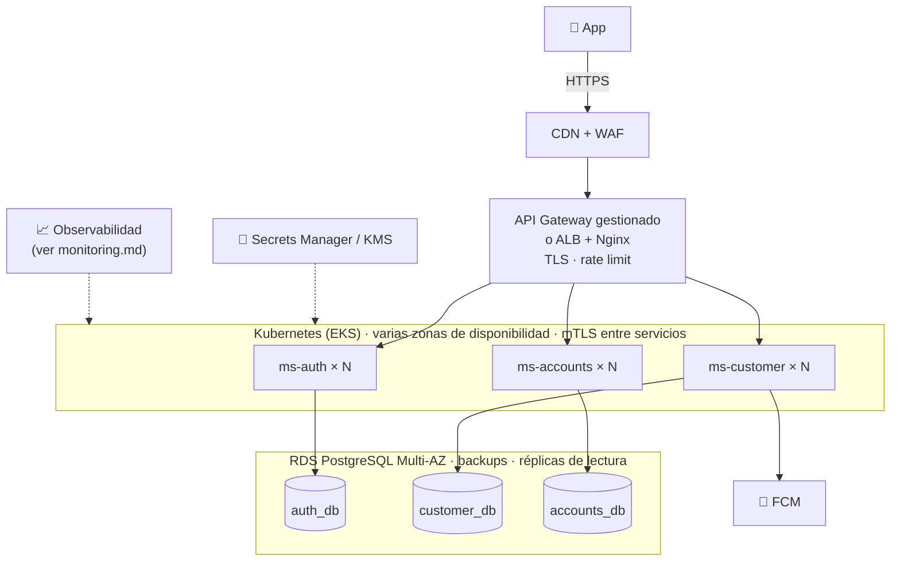

# Riesgos, escalamiento y despliegue

Qué puede salir mal, cómo se mitiga hoy, cómo crecería la plataforma y cómo se desplegaría en producción.
Los riesgos de seguridad se detallan en [`security.md`](security.md); el monitoreo, en
[`monitoring.md`](monitoring.md).

## Riesgos

Probabilidad e impacto: **A** (alto), **M** (medio), **B** (bajo).

### Técnicos y de operación

| Riesgo | Prob. | Impacto | Mitigación actual | Siguiente paso |
|---|---|---|---|---|
| **Dinero duplicado** por reintentos de la app o doble toque | M | A | `Idempotency-Key` obligatoria con `UNIQUE` por cliente, huella del contenido y verificación después del bloqueo. Probado con envíos simultáneos | Expirar las claves viejas (ver escalamiento) |
| **Saldo inconsistente** por concurrencia | M | A | Transacción única, `FOR UPDATE` en orden de id y `CHECK (balance >= 0)` en la base de datos. Probado con 30 débitos simultáneos | Conciliación diaria saldo vs. movimientos |
| **Cuenta con mucha contención** (*hot account*): muchas transferencias simultáneas sobre la misma cuenta | B | M | El bloqueo serializa; timeout de transacción de 10 s | Ver escalamiento: cola por cuenta para casos extremos |
| **Caída de un servicio** | M | M | Una base de datos por servicio; gateway con 503 en formato `ProblemDetail`; la app degrada por sección (caché, secciones independientes) | Varias réplicas por servicio |
| **ms-auth caído**: nadie puede iniciar sesión | B | A | Los demás servicios validan con el JWKS en caché, así que las sesiones abiertas siguen funcionando | Réplicas, y claves fijas en un gestor de secretos |
| **Base de datos lenta o saturada** | M | A | Timeouts de conexión (3 s), de consulta (5 s) y de transacción (10 s): se falla rápido en vez de colgar | Réplicas de lectura, PgBouncer, alertas del pool |
| **Onboarding a medias** (un servicio falla en el registro) | M | B | Credenciales al final, compensación del cliente y provisión idempotente | Job que limpie clientes huérfanos; saga con outbox si crece el volumen |
| **Notificación perdida** si ms-customer está caído al transferir | M | B | Es de mejor esfuerzo; la transferencia no se afecta y la app muestra el comprobante | Outbox y broker con reintentos |
| **Proveedor externo de tipo de cambio** caído o con cambios en su API | M | B | Proxy por el gateway con timeouts; la app cachea y oculta solo ese bloque | Caché en el gateway; segundo proveedor |
| **Configuración SDUI errónea** publicada en la base de datos | M | M | La app ignora tipos desconocidos y tiene un layout de respaldo y caché | Backoffice con validación, vista previa y auditoría de cambios |
| **Migración de base de datos que rompe** un despliegue | B | A | Flyway versionado y probado en CI con PostgreSQL real (Testcontainers) | Migraciones *expand/contract* (ver despliegue) |
| **Pérdida de la clave de cifrado** de datos personales | B | A | Clave obligatoria y externa al código | KMS con copia de seguridad y rotación (`v2:`) |
| **Claves JWT efímeras** en desarrollo | A | B | Solo afecta al entorno local | Claves en un gestor de secretos, con rotación vía JWKS |

### De producto y del proyecto

| Riesgo | Mitigación |
|---|---|
| Alcance limitado a transferencias entre cuentas propias | Decisión explícita (ADR-6). Las transferencias a terceros requieren un servicio de pagos con saga, límites, antifraude e integración con la red interbancaria |
| Código repetido entre servicios (seguridad, `ProblemDetail`, correlation-id) | Aceptado para mantener la autonomía. Si crece, se extrae a una librería interna versionada |
| Datos de prueba en las migraciones (`db/seed`) | Solo se cargan en desarrollo; en producción, `FLYWAY_LOCATIONS=classpath:db/migration` |

## Escalamiento

### Servicios

Los tres servicios son **stateless**: la sesión vive en el JWT y el estado en sus bases de datos. Por eso escalan
**horizontalmente** agregando réplicas detrás del balanceador, sin afinidad de sesión.
- La CPU del login la consume Argon2 (deliberadamente costoso): ms-auth escala por CPU.
- ms-accounts y ms-customer escalan por peticiones y latencia (HPA en Kubernetes).
- Cada servicio escala por separado, según su propia carga.

### Bases de datos

| Presión | Solución |
|---|---|
| Lecturas de cuentas y movimientos (lo más frecuente) | Réplicas de lectura para las consultas; las escrituras siguen en el primario |
| Crecimiento de `movements` | Particionar por fecha (`booked_at`, mensual). El índice actual `(account_id, booked_at DESC, id DESC)` y la paginación por cursor siguen funcionando |
| Muchas conexiones al escalar réplicas | PgBouncer en modo transacción delante de PostgreSQL |
| Crecimiento de `transfers` (claves de idempotencia) | Archivar las claves pasadas la ventana de reintento (por ejemplo, 30 días) y conservar las transferencias en histórico |
| `refresh_tokens` revocados o vencidos | Job de limpieza periódico |

### Operaciones de dinero

- **Hot accounts:** si una cuenta recibe una cantidad extrema de operaciones simultáneas (por ejemplo, la de un
  comercio), se encolan sus operaciones y se procesan en serie por cuenta (partición por `account_id` en un broker).
  Para el caso de banca personas no hace falta.
- **Transferencias a terceros e interbancarias:** un servicio de pagos con una saga y outbox: reservar fondos,
  enviar a la red y confirmar o liberar. El débito local deja de ser inmediato y la app pasa a mostrar estados como
  "en proceso".

### Eventos entre servicios

Hoy las notificaciones y el onboarding usan llamadas HTTP síncronas o de mejor esfuerzo. Al crecer, la evolución es
el **patrón outbox**: cada servicio escribe el evento en su base de datos en la misma transacción y un proceso lo
publica en un broker (Kafka o RabbitMQ). Se gana entrega garantizada, reintentos y nuevos consumidores (antifraude,
analítica) sin tocar el servicio que emite el evento.

### Lecturas costosas

- **Home (SDUI):** ya usa ETag (304 si no cambió). Los componentes configurados se pueden cachear en memoria con
  un TTL corto, porque cambian poco.
- **Tipo de cambio:** caché en el gateway (por ejemplo, 5 minutos). Así se respeta el límite del proveedor y se
  responde aunque esté caído.

## Despliegue en producción

### Topología propuesta (ejemplo en AWS; equivalente en otras nubes)

- **Alta disponibilidad:** al menos 2 réplicas por servicio en zonas distintas, y bases de datos Multi-AZ con
  failover automático.
- **Secretos:** las claves JWT, la API key interna, la clave de datos personales y las credenciales de FCM y de la
  base de datos salen de un gestor de secretos, nunca del repositorio ni del compose.
- **Red:** los servicios y las bases de datos en subredes privadas; solo el borde es público.

### Entrega continua

1. **CI** (ya existe): en cada PR se compila y se ejecutan las pruebas unitarias y de integración con PostgreSQL
   real; también se validan el compose y el gateway.
2. **Imagen versionada** por commit, escaneada en busca de vulnerabilidades, y publicada en un registro privado.
3. **Despliegue gradual** (*canary* o *blue/green*): primero un pequeño porcentaje del tráfico. Se avanza si los SLO
   se mantienen (ver `monitoring.md`) y se revierte automáticamente si no.
4. **Migraciones *expand/contract*:** primero se agrega lo nuevo sin romper lo viejo (columna nueva, por ejemplo);
   se despliega el código que usa ambos; y en un release posterior se elimina lo viejo. Así, la versión anterior
   sigue funcionando durante el despliegue y un rollback es seguro.
5. **Compatibilidad con la app:** los cambios de API son aditivos y la app ignora los campos y componentes SDUI
   desconocidos. Si hace falta romper el contrato, se versiona la ruta y se mantiene la anterior mientras haya
   versiones de la app que la usen.

### Respaldo y recuperación

| Dato | Estrategia | Objetivo |
|---|---|---|
| Bases de datos | Backups automáticos con *point-in-time recovery* y réplica en otra región | RPO ≤ 5 min · RTO ≤ 1 h |
| Clave de datos personales | En KMS, con copia de seguridad de la clave | Sin ella los datos cifrados son irrecuperables |
| Configuración SDUI | Versionada y auditada (backoffice) | Volver a la versión anterior en segundos |

Las restauraciones se ensayan periódicamente: un backup que nunca se restauró no es un backup confiable.
